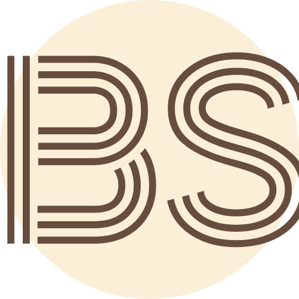
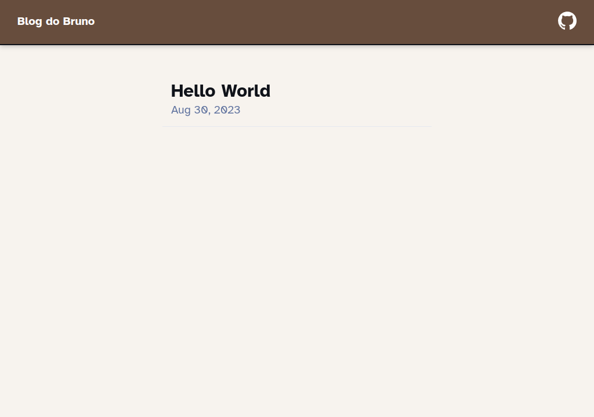
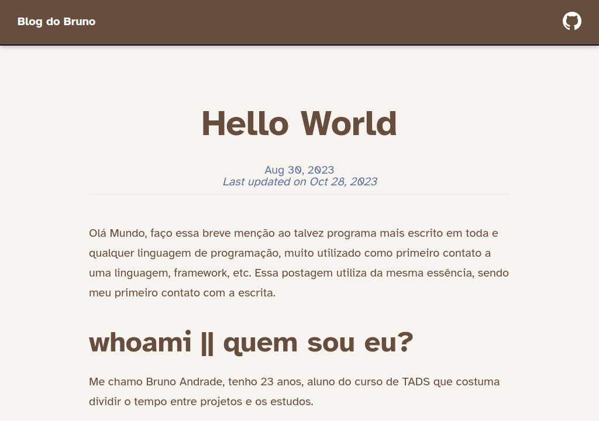

<!-- PROJECT LOGO -->
 

  

  <h3 align="center">My Blog</h3>

<!-- ABOUT THE PROJECT -->
## About The Project

  
  

 
A simple and minimalist blog with only a homepage and the posts pages. There are no page to login, to push posts, to edit or other stuff like that.

(<a href="#readme-top">back to top</a>)

### Built With

This was built with [Astro](https://astro.build) using it blog template with a little bit of changes to customize to myself.

(<a href="#readme-top">back to top</a>)

