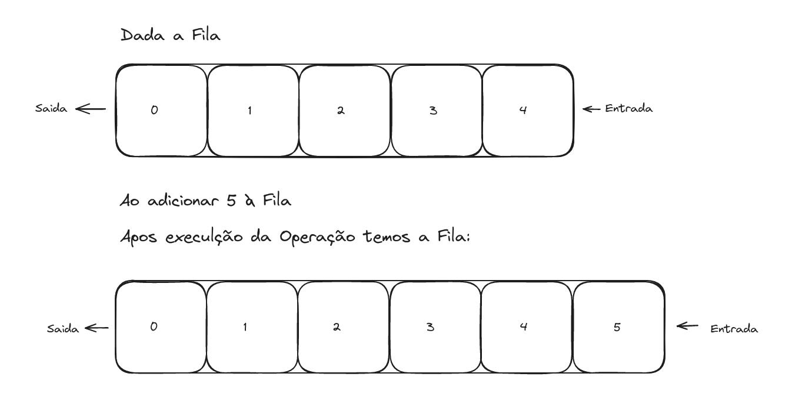
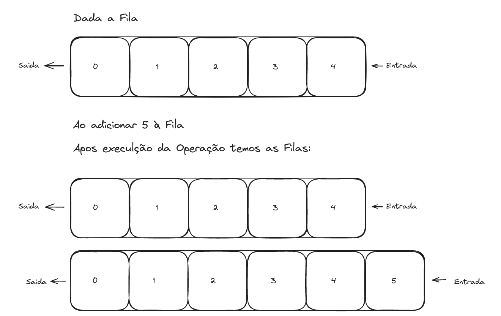

Neste artigo, pretendo abordar de modo sucinto o tópico de Estrutura de Dados e ilustrar as diferenças entre implementações Persistentes e Efêmeras, assim como destacar pontos a respeito de cada implementação.

O presente artigo não trata exclusivamente de uma Estrutura de Dados, mas sobre o tópico em geral. Majoritariamente o que neste é debatido pode ser aplicado a qualquer Estrutura de Dados.

## Estruturas de Dados

Como dito no nome são formas de se estruturar, organizar e agrupar dados para melhor utilização de recursos. Estão amplamente presentes em todo tipo de aplicação. Filas, Pilhas, Listas Encadeadas, Hash Tables, Arrays, Grafos, Árvores são exemplos de Estruturas de Dados amplamente conhecidas.

Cada estrutura possui seu modo particular de gerir os dados de modo que cada uma possa prover vantagens conforme a intenção de utilização. Uma Fila é uma estrutura muito eficiente quanto a inserção e remoção de dados em padrão FIFO (First In First Out, primeiro a entrar primeiro a sair), enquanto uma Pilha é muito eficiente quanto a inserção e remoção de dados em padrão FILO (First In Last Out, primeiro a entrar último a sair). Ainda que ambas as estruturas possuam vantagens acentuadas se tratando destes padrões são ineficientes se comparadas quanto a acesso randômico.

Quanto ao acesso randômico Arrays são estruturas otimizados para tais tipos de acessos, mas exigem alocação de recursos no momento de sua definição se tornando ineficientes caso não haja quantidade de inserções e remoções razoavelmente previsíveis. Ponto de destaque para Listas Encadeadas visto que a inserção de um novo elemento ocorre de maneira dinâmica na memória, podendo assim alocar e desalocar recursos na realização da operação. Entretanto, Listas Encadeadas são menos eficientes que Árvores quando o assunto é ordenação.

Estes são alguns exemplos sobre como a utilização de Estruturas de Dados dependem do contexto, não existe bala de prata e tratando-se deste assunto não seria diferente. Apesar de destacar vantagens e desvantagens de algumas estruturas de Dados, a definição destas são abstrações que regem como uma estrutura deve se comportar, porém, a eficiência de uma estrutura é fortemente atrelada a sua implementação.

Implementações podem variar de caso a caso, mas neste artigo gostaria de enfatizar a diferença entre implementações efêmeras e implementações persistentes.

### Estruturas Efêmeras

Estruturas de Dados Efêmeras ou Implementações Efêmeras, são aquelas que mantém apenas um único Estado dos dados, ao realizar uma operação que altere o estado a Estrutura de Dados em questão não preserva o estado atual dos dados. Observe o exemplo:




No início temos a **Fila \[0, 1, 2, 3, 4\]**, ao realizar a operação de inserção a estrutura inicial é modificada para a **Fila \[0, 1, 2, 3, 4,  5\]**. Perceba que o Estado precedente a operação não é preservado e se torna inacessível após a operação.

Exemplo em código:
```js
let queue = new Queue([1,2,3,4]);
console.log(queue); // [1,2,3,4]
queue.insert(5);
console.log(queue); // [1,2,3,4,5]
```

Modelo mais semelhante ao utilizada em Programação Imperativa e Programação Orientada a Objetos, utilizando de mutabilidade para realizar a alteração na estrutura.

### Estruturas Persistentes

Uma vaga definição para Persistência em uma Estrutura de Dados é o suporte a múltiplas versões de si mesma, sendo assim, deliberando a capacidade de realizar consultas a estados passados de uma estrutura. Observe um exemplo:



No início temos a **Fila \[0, 1, 2, 3, 4\]**, ao realizar a operação de inserção mantemos a **Fila \[0, 1, 2, 3, 4\]** inalterada e como resultado da operação temos a nova estrutura **Fila \[0, 1, 2, 3, 4, 5\]**. Perceba que o Estado precedente a operação é preservado na fila inicial e segue tão acessível quanto o novo Estado ambos podendo ser consultados e modificados.

Exemplo em código:
```js
let queue1 = new Queue([1,2,3,4]);
console.log(queue1); // [1,2,3,4]
let queue2 = queue1.insert(5);
// ou let queue2 = Queue.insert(queue1, 5)
console.log(queue1); // [1,2,3,4]
console.log(queue2); // [1,2,3,4,5]
```
Modelo semelhante ao utilizada em Programação Funcional, para que ambas as versões da estrutura sigam disponíveis a implementação deve evitar a utilização de mutabilidade.

Porém há diferentes tipos de persistência, sendo assim, faz-se necessário falar sobre os níveis de persistência.

#### Níveis de Persistência

1. **Persistência Parcial**:
	- Nesse nível de persistência podemos consultar qualquer versão anterior da estrutura, mas podemos atualizar apenas a última versão.
	- Com operações como:
		- read(var, version) -> para ler determinado valor em determinada versão;
		- write(var, val) -> para atualizar determinado valor na última versão.
	- Por definição este tipo de persistência implica em uma ordem linear de versões.
2. **Persistência Completa**:
	- Nesse nível de persistência podemos tanto consultar quanto realizar atualizações em quaisquer versões da estrutura.
	- Com operações como:
		- read(var, version) -> para ler determinado valor em determinada versão;
		- write(var, version, val) -> para atualizar determinado valor na última versão.
	- Por definição este tipo de persistência implica em ordem como ramificações em formato de árvores.
3. **Persistência Confluente**:
	- Nesse nível de persistência, além das propriedades apresentadas no modelo de Persistência Completa temos também uma nova operação que permite combinar versões para formar uma nova versão.
	- Com operações como:
		- read(var, version) -> para ler determinado valor em determinada versão;
		- write(var, version, val) -> para atualizar determinado valor na última versão;
		- combine(version1, version2) -> para combinar versões em uma nova versão.
	- Por definição este tipo de persistência implica em ordem como um Grafo Dirigido Acíclico.
4. **Persistência Funcional**:
	- Nesse nível de persistência recebe este nome da [[Funcional || Programação Funcional]], devido a utilização de imutabilidade. Os nós neste modelo são imutáveis. Alterações não mudam os nós existentes na estrutura de dados, mas sim criam novos nós com as alterações aplicadas.
	- Por definição este tipo de persistência não vincula uma ordem entre versões uma vez que diferentes versões são alocadas em espaços diferentes de memória e não compartilham recursos.
	- Nível apresentado como exemplo acima.

Antes de entrar em mais detalhes a respeito de cada nível de persistência, é necessário esclarecer que para uma grande quantidade de casos de estruturas de dados e para os diferentes níveis persistência é possível realizar adequações na estrutura e obter persistente a partir de algum trabalho extra e um pequeno overhead de espaço.

Sendo assim, não necessariamente uma Estrutura de Dados Persistente é totalmente diferente de uma Efêmera. A ideia por trás das adaptações é aproveitar da retenção da informação pagando o menor custo possível, seja em tempo de processamento ou em espaço de armazenamento.

## Casos de Uso

Apesar de cada modelo de implementação suprir a abstração dos métodos de cada Estrutura de Dados, por tratar de modo distinto o Estado cada tipo de implementação possui características particulares. Visto que armazenar o Estado tem seus custos sua utilização fica restrita aos casos em que a preservação do Estado faz-se por necessária.

Tratando-se de quantidade de utilizações efetivas grande parte das Estruturas de Dados utilizadas usam de Implementações Efêmeras para prover funcionalidade com eficiência. Como exemplo Grafos são extremamente uteis para representar conexões em Redes Sociais, manter qualquer estado passado desta estrutura é pouco interessante visto seu grande custo e pouca aplicabilidade da conservação.

Há alguns cenários em que manter o Estado anterior da Estrutura de Dados é extremante relevante para a aplicação, como, por exemplo, o caso da Estrutura de Dados denominada de Corda que permite trabalhar com longos textos de forma eficiente. Editores de texto utilizam-se dessa Estrutura implementada de modo Persistente para manter suporte a funcionalidades como desfazer e refazer.

Além de que linguagens puramente funcionais, como Haskell ou Lean, podem não conter dentre de suas funcionalidade o aspecto de mutabilidade dessa forma restringindo a utilização de implementações não persistentes.

## Diferenças

A divergência entre os tipos de implementações estão claramente atreladas como cada tipo trata as alterações no Estado da Estrutura de Dados. Quesito que influência diretamente a utilização de recursos para atingir as funcionalidades esperadas.

Para satisfazer uma Implementação Persistente e manter versões anteriores amplamente disponíveis para utilização faz-se por necessário alocar mais memória frente a uma implementação Efêmera. Não apenas alocação de memória pode fazer parte do custo de manter o versionamento como também custo de processamento e maior complexidade em sua implementação.

## Conclusão

Sem entrar em muitos detalhes técnicos e muito específicos espero ter abordado de modo breve e suficiente para introduzir o tema. Em posts futuros pretendo abordar com mais detalhes a Persistência em Estruturas de Dados.

## Referências

Chris Okasaki - [Purely Functional Data Structures](https://www.cs.cmu.edu/~rwh/students/okasaki.pdf) - 1996

Reema Thareja - (Data Structures Using C)[https://aa.bbs.tr/lab/cen215-data-structures/Data-Structures-Using-C-2nd-edition.pdf] - 2011

