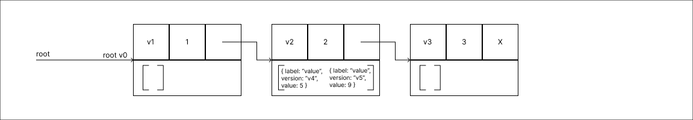
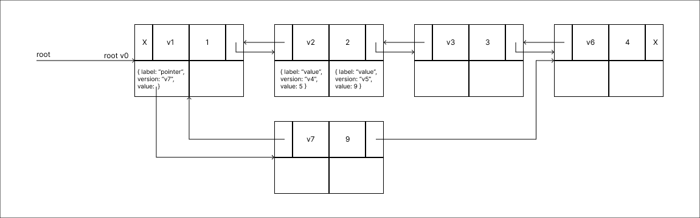

No post [Introdução a Estruturas de Dados Efêmeras e Persistentes](https://blog.brunoan.dev/posts/ephemeral-persistent-data-structures/) pude abordar sucintamente a diferença conceitual entre Estruturas Efêmeras e Estruturas Persistentes. Tópico também abordado foi a existência de 4 formas diferentes de Persistência. Nesse post, venho falar com mais detalhes a respeito da Persistência Parcial.

## Persistência Parcial

Vale a pena relembrar que nesse nível de persistência podemos consultar qualquer versão de uma estrutura, porém atualizações só podem ser realizadas na última versão.

Neste nível como dito a ideia é implementar de uma maneira de conservar estados anteriores da estrutura, mas apenas para consultas. Sendo assim, como é possível implementar Persistência Parcial de forma eficiente?

Para essa pergunta não existe uma única resposta, ao longo do tempo técnicas foram introduzidas de modo a tornar o processo mais eficiente. Ainda assim vale a pena conhecer os processos adotados no passado.

Para seguir uma linha de raciocínio para cada exemplo vou realizar a seguinte **Sequência de Operações**:

1. Iniciar a Estrutura **vazia**;
2. Adicionar um valor **1**;
3. Adicionar um valor **2**;
4. Adicionar um valor **3**;
5. Alterar o valor de **2** para **5**;
6. Alterar o valor de **5** para **9**;
7. Adicionar um valor **4**;
8. Remover o valor **3**;
9. Remover o valor **4**;
10. Remover o valor **1**;
11. Remover o valor **9**.

Além de descrever os métodos para se atingir a **Persistência Parcial**, uma referência deve ser estabelecida a fins de comparação. Tomaremos como parâmetro uma **Lista Encadeada** e de diferentes formas iremos transformá-la em **Parcialmente Persistente**. Mas, antes de qualquer conversão, vale representar uma Implementação Efêmera.

Não pretendo abordar o código de implementação de cada método neste post. Por fins de simplicidade me limitarei a representar a estrutura apenas utilizando os tipos em código e uma sequência visual da estrutura reagindo as operações propostas.

<br>

### Exemplo Efêmero

Acredito não ser novidade para ninguém para representar os *tipos*, deste exemplo, definiremos uma **Lista Encadeada** através de um **Modelo de Máquina de Ponteiros**. Podemos pensar num agrupamento linear de nós, denominados **Nodes**, em que cada nó pode conter dados e ponteiros para outros nós. Podemos definir os *tipos* da seguinte forma:

```rust
struct Node<T> {
  value: T;
  pointer: Option<Box<Node>>;
}

struct EphemeralLinkedList<T> {
  root: Option<Box<Node>>;
}
```

Tendo definido os tipos, segue a representação visual da Estrutura:

1. **Começar com a Estrutura vazia**: <br> 

2. **Adicionar um valor 1**: <br> 

3. **Adicionar um valor 2**: <br> 

4. **Adicionar um valor 3**: <br> 

5. **Alterar o valor 2 para 5**: <br> 
  Assim que o valor é atualizado a informação a respeito do antigo valor ***2*** passa a ser irrecuperável.

6. **Alterar o valor 5 para 9**: <br> 
  Novamente, assim que o valor é atualizado a informação anterior é totalmente perdida.

7. **Adicionar um valor 4**: <br> 

8. **Remover o valor 3**: <br> 
  Ao remover o **Node** perde-se a informação que este antes continha.

9. **Remover o valor 4**: <br> 

10. **Remover o valor 1**: <br> 

11. **Remover o valor 9**: <br> 

<br>

A medida que alterações são realizadas a informação prévia é perdida. De modo que, ao final do processo, após uma operação de remoção para cada operação de inserção a Estrutura de Dados não contém registro algum do passado.

Obviamente na maioria dos casos, esta será a melhor implementação possível, visto que nem todo contexto se beneficia da conservação dos estados anteriores. Uma vez que para manter toda e qualquer informação há um custo, seja de maior uso de memória ou de processamento.

Entretanto, caso a perda de informação toque negativamente um processo, a utilização de uma implementação Efêmera, como este exemplo, trará inúmeras dificuldades. Sendo assim, vamos para o primeiro método abordado neste post.

<br>

### Método das Cópias

O método mais primitivo possível para implementar a **Persistência Parcial**, consiste em gerar cópias da estrutura para cada alteração realizada e manter uma lista de versões que disponibilize consultas para toda e qualquer versão desejada.

Neste método a estrutura dos **Nodes** utilizados não sofrerá alterações, em comparação com Modelo Efêmero, permanecendo como:

```rust
struct Node<T> {
  value: T;
  pointer: Option<Box<Node>>;
}
```

Neste método, diferentemente da Estrutura Efêmera, não podemos ter uma **root** que aponte diretamente para um nó, visto que para cada alteração uma nova cópia da estrutura é armazenada. Para manter acesso de cada cópia individualmente podemos utilizar um Vetor.

```rust
use std::colections::HashMap

struct LinkedList<T> {
  root: Option<Box<Node>>
}

struct CopyMethodLinkedList<T> {
  root: Vec<LinkedList<T>>
}
```

Tendo definido os tipos, segue a representação visual da Estrutura:
1. **Começar com a Estrutura vazia**: <br> 
  Perceba que a raiz não começa literalmente vazia, como a raiz neste cenário constitui-se de um Vetor de versões, esta então deve começar com um item correspondente a versão inicial da estrutura. Um Vetor vazio pode expressar que a estrutura nunca esteve vazia, por isso principalmente deve ser iniciada com uma versão sem nós.

2. **Adicionar um valor 1**: <br> 
  Ao realizar uma operação a raiz anterior não é alterada uma nova é adicionada, com as mudanças processadas.

3. **Adicionar um valor 2**: <br> 

4. **Adicionar um valor 3**: <br> 

5. **Alterar o valor 2 para 5**: <br> 

6. **Alterar o valor 5 para 9**: <br> 

7. **Adicionar um valor 4**: <br> 

8. **Remover o valor 3**: <br> 

9. **Remover o valor 4**: <br> 

10. **Remover o valor 1**: <br> 

11. **Remover o valor 9**: <br> 

<br>

Nesta estrutura, toda e qualquer versão existente está disponível para consulta e para satisfazer a **Persistência Parcial** basta então restringir atualizações a última versão. Tendo isto sido feito esta implementação pode ser tida como **Parcialmente Persistente**.

Note que ao decorrer do processo cada atualização adiciona a estrutura uma versão equivalente a versão efêmera anteriormente apresentada para tal atualização.

Como este método utiliza-se de cópias para conservar a informação. A medida que a Estrutura cresce em números de **Nodes**, a atualização realizada passa a ser cada vez menos significante comparada a quantidade de memória despendida para realizar a cópia de todo o resto da estrutura que não será modificado.

Ainda que a estrutura não venha a atingir uma quantidade exagerada de **Nodes**, o consumo de memória tende apenas a crescer mais e mais, logicamente, em quantidades proporcionais ao tamanho das versões.

Ao longo da história outros métodos foram propostos para lidar com essa questão. É hora de abordar outro dos primeiros métodos. Segue o método do Histórico.

<br>

### Método do Histórico

Como dito no nome o método em questão utiliza de um histórico para manter o controle de versões da Estrutura. Este histórico funcionará com um registro ordenado das alterações realizadas, sendo assim, suprimindo a exigência de manter em memória qualquer versão.

No que tange as atualizações, para realizar quaisquer alterações na estrutura basta apenas inserir no Array o registro, note que no parágrafo passado delimitamos que este registro deve ser ordenado, tendo em consideração que para **Persistência Parcial** não desejamos que atualizações possam ser realizadas a partir de qualquer versão devemos delimitar que toda e qualquer atualização deve ser inserida na última posição.

Quanto as consultas, para realizar qualquer consulta devemos processar a estrutura para a versão desejada e só então realizar a consulta.

Para representar tal solução não há necessidades de **Nodes** ou alguma Estrutura com uma **root**, apenas um tipo que defina as operações e uma estrutura que armazene esse tipo de forma sequencial, como um Vetor. Tal qual pode ser representado da seguinte maneira:

```rust
enum Op {
  Add,
  Remove
}

enum Update<T> {
  ValueUpdate { from: T, to: T },
  NodeUpdate { value: T, op: Op }
}

struct HistoryMethodLinkedList<T> {
  history: Vec<Update<T>>
}
```

Tendo definido os tipos, segue a representação visual da Estrutura:

1. **Começar com a Estrutura vazia**: <br> 
  Ao contrário dos exemplos anteriores, que a Estrutura da versão vazia se tratava de uma **root** que não apontava para um **Node**. Neste caso não apenas não temos uma **root** tampouco uma estrutura concreta.

2. **Adicionar um valor 1**: <br> 
  Ao realizar a atualização apenas inserimos no Vetor o registro que descreva a mudança.

3. **Adicionar um valor 2**: <br> 

4. **Adicionar um valor 3**: <br> 

5. **Alterar o valor 2 para 5**: <br> 

6. **Alterar o valor 5 para 9**: <br> 

7. **Adicionar um valor 4**: <br> 

8. **Remover o valor 3**: <br> 

9. **Remover o valor 4**: <br> 

10. **Remover o valor 1**: <br> 

11. **Remover o valor 9**: <br> 

Através do registro das alterações conseguimos satisfazer as condições necessárias para atingir a **Persistência Parcial**, novamente vale reiterar que para manter a condição satisfeita novos registros devem sempre ser inseridos ao fim do histórico.

Divergentemente do método das cópias o uso de memória nesta solução é baixo e não escala com o crescimento da estrutura. Além do custo de memória reduzido processar novas operações tem o custo de inserção em um Vetor.

O calcanhar de Aquiles dessa abordagem são as consultas, realizar uma consulta exige montar a estrutura do zero o que será caro em termos processamento, principalmente consultando versões distantes do início. Parte expressiva desse problema está no fato de que para cada consulta a estrutura deve ser montada novamente, a falta de aproveitamento de montagens anteriores torna o processo muito ineficiente.

Porém atribuir uma solução de cache, memorização ou qualquer técnica dinâmica semelhante não é muito interessante, num cenário mediano na tentativa de reduzir o problema das consultas bateríamos novamente na tecla na memória. Podendo até a manter em registro um histórico completo de todas as versões assim como no método das cópias, e em adicional o histórico de alterações.

Apesar da baixa utilização de memória desta proposta a uma compensação suficientemente negativa no custo de processamento de cada consulta. Por razões como esta, abordaremos um outro método, o método Híbrido de Histórico.

<br>

### Método Híbrido

Trata-se de um meio termo entre o **Método do Histórico** e o **Método das Cópias**. Assim como no **Método do Histórico** este método utilizará de uma lista para manter o registro de alterações. Também compartilhando semelhanças com o **Método das Cópias**, este apresenta uma raiz com ramificações que apontam para diferentes versões.

No método anterior debatemos a ideia de utilizar alguma técnica dinâmica para recuperar a construção de versões e agilizar as consultas. O problema comentado foi de que sem um devido controle, versões demais poderiam ser armazenadas e novamente haver problemas quanto a otimização do uso de memória.

A abordagem gira em tordo desse controle. Este método estabelece um número fixo ***N*** de atualizações para cada versão da estrutura construída. Sendo assim, cada ramificação nesta solução irá conter uma estrutura construída e uma lista que pode chegar até a ***N*** atualizações.

Para cada ***N*** novas atualizações uma nova ramificação é construída, permitindo manter uma disponível a informação de toda e qualquer atualização realizada. Podemos definir os tipos da seguinte forma:

```rust
enum Op {
  Add,
  Remove
}

enum Update<T> {
  ValueUpdate { from: T, to: T },
  NodeUpdate { value: T, op: Op }
}

struct Node<T> {
  value: T;
  pointer: Option<Box<Node>>;
}

struct Step<T, const N: usize> {
  structure: LinkedList<T>,
  updates: [Update<T>, N]
}

struct HybridMethodLinkedList<T, const N: usize> {
  steps: Vec<Step<T, N>>
}

```

Tendo definido os tipos, segue a representação visual da Estrutura:

1. **Começar com a Estrutura vazia**: <br> 
  Novamente temos a presença de uma **root**, porém, ao contrário do **Modelo das Cópias** a root não aponta diretamente para um **Node**. Neste caso instância vazia contém uma ramificação para versão zero, nessa ramificação há uma estrutura vazia construída e uma lista de atualizações também vazia.

2. **Adicionar um valor 1**: <br> 
  A medida que atualizações são realizadas, faz-se a adição da atualização na lista de **updates**, enquanto a **structure** permanece inalterada.

3. **Adicionar um valor 2**: <br> 

4. **Adicionar um valor 3**: <br> 

5. **Alterar o valor 2 para 5**: <br> 
  Atingindo o valor ***N*** de atualizações que cada ramificação deve suportar, uma nova ramificação é criada, nesta etapa ocorre o processamento de uma **structure** com as atualizações realizadas até então.

6. **Alterar o valor 5 para 9**: <br> 

7. **Adicionar um valor 4**: <br> 

8. **Remover o valor 3**: <br> 
  Assim como nos métodos anteriores para implementação da **Persistência Parcial**, perceba-que, ainda que uma operação de remoção seja processada informações não são perdidas.

9. **Remover o valor 4**: <br> 

10. **Remover o valor 1**: <br> 

11. **Remover o valor 9**: <br> 

<br>

A solução em questão faz um balanço entre os custos de memória para armazenar as diversas cópias do **Método das Cópias** e o custo de processamento das consultas do **Método do Histórico**, como diz o nome trata-se de uma solução híbrida.

Note que há um detalhe flexível nesta implementação. No quinto passo, ao alterar o valor de 2 para 5, uma nova ramificação é criada e a estrutura dessa ramificação já contém a mudança processada. Uma outra forma de fazer essa implementação seria por construir apenas a versão anterior e inserir a atualização no registro. Porém nessa outra abordagem, a estrutura armazenada seria equivalente a ***N - 1***, logo o que no exemplo é ***v4*** nessa abordagem seria ***v3***.

Perto dos outros métodos para conversão em **Parcialmente Persistente** este utiliza menos memória e tem um custo de consulta amortizado. Mas ainda assim, perto de uma estrutura Efêmera, custa caro.

E esse custo pode ser atribuído aos processos realizados para manter a informação. Perceba que todos os métodos utilizam de clones dos **Nodes** (para o método do Histórico os **Nodes** são constantemente *clonados* a cada consulta). **Nodes** são pouco aproveitados no processo. Deste ponto trata o próximo método.

<br>

### Um Método Mais Eficiente

Os métodos anteriores, ainda que tenham cumprido com o objetivo de implementar a **Persistência Parcial**, falham no que tange a eficiência. Utilizam de muitos recursos, para satisfazer as condições desejadas.

Um método mais eficiente é também mais simples. O próximo método a ser abortado é denominado de **Fat Node**, e como o nome indica a ideia é permitir que as alterações sejam realizadas e armazenadas no próprio **Node**, fazendo com que este cresça em tamanho.

Para permitir tais adequações de modo eficiente algumas modificações têm de ser realizadas a estrutura do **Node**. O Node segue mantendo um campo para valor e para ponteiro. E além destes, passará a conter um campo para uma lista de modificações e um campo para a versão em que o **Node** foi adicionado.

A depender das operações realizadas com a estrutura a **root** pode apontar para diferentes nós, como por exemplo no caso de exclusão do primeiro nó. Neste caso para a **root** utilizaremos de um HashMap para designar cada ramificação de acordo com as versões, pois nem toda versão terá uma ramificação e uma nova versão pode ou não ser gerada a depender da exclusão da atual **root**.

```rust
struct Mod<T> {
  label: String;
  version: String;
  value: T;
}

struct FatNode<T> {
  value: T;
  version: String;
  pointer: Option<Box<FatNode<T>>>;
  mods: Vec<Mod<T | Option<Box<FatNode<T>>>>>
}

struct FatNodeMethodLinkedList<T> {
  root: HashMap<i32, Option<Box<FatNode<T>>>>;
}
```

Tendo definido os tipos, segue a representação visual da Estrutura:


1. **Começar com a Estrutura vazia**: <br> 
  De forma semelhante ao **Método das Cópias** temos uma **root** que é iniciada com um HashMap de versões, já contendo um item correspondente a versão inicial da estrutura.

2. **Adicionar um valor 1**: <br> 
  Diferentemente do **Método das Cópias** e de forma semelhante ao **Método Híbrido**, aqui nem toda alteração vai gerar uma nova versão.

3. **Adicionar um valor 2**: <br> 
  Não precisamos adicionar modificador à primeira alteração feita no ponteiro, uma vez que o node subsequente tem o rótulo da versão, sabemos que a apenas a partir dessa versão temos o ponteiro naquela posição.

4. **Adicionar um valor 3**: <br> 

5. **Alterar o valor 2 para 5**: <br> 
  A atualização é adicionada a lista de modificações.

6. **Alterar o valor 5 para 9**: <br> 

7. **Adicionar um valor 4**: <br> 

8. **Remover o valor 3**: <br> 
  Na remoção de um valor, apenas adicionamos uma atualização a lista de modificações, contendo uma alteração ao campo de ponteiro, ponteiro este que passa a aportar para o próximo node na sequência. Perceba que o **Node** com valor 3, segue na estrutura na mesma posição contendo as mesmas informações.

9. **Remover o valor 4**: <br> 
  Novamente um **Node** é removido na versão em questão, nesse caso, como não há outro node na sequência do removido a modificação então deve receber o valor respectivo ao caso vazio.

10. **Remover o valor 1**: <br> 
  A **root** da versão v0, a mais recente até então, aponta diretamente para o **Node** que será removido, neste caso ou em casos de inserções na primeira posição, uma nova raiz é adicionada ao HashMap de ramificações.

11. **Remover o valor 9**: <br> 

<br>

Modelo mais próximo da Estrutura Efêmera até então. Segue estrutura semelhante, mantendo as atualizações no próprio **Node** e evitando processos de duplicação. Dessa forma reduzindo a quantidade de memória necessária no decorrer do processo.

Um contraponto dessa abordagem é que os **Nodes** não tem delimitação de crescimento. Uma vez que para realizar qualquer consulta as alterações presentes no campo de modificações devem ser processadas, **Nodes** altamente modificados podem trazer dificuldades em consultas. De modo semelhante ao que foi abordado no **Método do Histórico**.

Imagine que um **Node** com inúmeras atualizações é frequentemente consultado, toda consulta será cara. Sendo assim uma otimização que pode ser feita a esse método, e disso trata o próximo método.

<br>

### Um Método Ainda Mais Eficiente

Método conhecido como **Node Spliting**. Essa solução muito se assemelha a solução abordada no **Método Híbrido**, neste caso definiremos um número arbitrário ***N*** de modificações que um **Node** pode aceitar e caso alguma modificação extra seja realizada, esta deve ser processada em um **Node** a parte.

No processo de implementação da divisão de um **Node** há uma dificuldade que é manter atualizada a referência para o **Node** mais recente. Para que seja possível atualizar quaisquer referências no momento da divisão, adota-se a estratégia de manter um ponteiro inverso, apontando para os **Nodes** que apontam para o **Node** que será dividido, dessa forma após a divisão podemos acessar os antecessores e realizar a atualização do ponteiro para o novo **Node**.

Os *tipos* podem ser representados da seguinte forma:

```rust
struct Mod<T> {
  label: String;
  version: String;
  value: T;
}

struct FatNode<T, const N: usize> {
  value: T;
  version: String;
  pointer: Option<Box<FatNode<T>>>;
  back_pointer: Option<Box<FatNode<T>>>
  mods: [Mod<T | Option<Box<FatNode>>>; N]
}

struct NodeSplittingMethodLinkedList<T, const N: usize> {
  root: HashMap<String, Option<Box<FatNode<T, N>>>>;
}
```

Tendo definido os tipos, segue a representação visual da Estrutura:

1. **Começar com a Estrutura vazia**: <br> 
  Assim como no **Método do FatNode** temos uma root que é iniciada com um HashMap de versões, já contendo um item correspondente a versão inicial da estrutura.

2. **Adicionar um valor 1**: <br> 

3. **Adicionar um valor 2**: <br> 

4. **Adicionar um valor 3**: <br> 

5. **Alterar o valor 2 para 5**: <br> 

6. **Alterar o valor 5 para 9**: <br> 

7. **Adicionar um valor 4**: <br> 

8. **Remover o valor 3**: <br> 
  Ao passo de remover o valor 3 faz-se necessário adicionar uma modificação ao seu nó antecessor, porém este já se encontra totalmente preenchido. Dessa forma como ilustrado a solução é realizar o **Split** do **Node**, e nesse processo uma modificação também deve ser incluída no **Node** antecessor ao dividido. Além disso, perceba que o novo **Node** é gerado com os campos mais atualizados e já incluindo a alteração realizada na operação.

9. **Remover o valor 4**: <br> 

10. **Remover o valor 1**: <br> 

11. **Remover o valor 9**: <br> 

Não muito diferente do resultado obtido através do **Método do Fat Node**, aqui seguimos com a utilização dos **Nodes**, as diferenças rondam a delimitação fixa de tamanho para a quantidade de **Mods**.

Um caso não abordado nesse exemplo é o cenário em que desejamos fazer alteração em um **Node** e este e seu antecessor ambos estão cheios. Digamos que no passo 6 do exemplo passado, o **Node** com valor 1 já havia sido mudado para 6 e 7 anteriormente. Da seguinte maneira:

1. **Estado inicial**: <br> 
  Digamos que tendo essa estrutura a próxima operação a ser processada sendo a de remoção do **Node** com valor **3**. De modo a realizar a operação não apenas o **Node** em questão deve ser divido. Mas também seu antecessor que não comporta modificação para representar a divisão.

2. **Estado final após atualização**: <br> 
  Ao final do processo ambos os **Nodes** foram adicionados na mesma operação por esse motivo têm mesmo rótulo de versão, assim como a nova raiz criada em decorrência do processo.

Se por exemplo todos os **Nodes** de uma estrutura estivessem cheios de modificações e por um acaso a próxima operação visa modificar o último **Node**. Bem nesse caso, como no exemplo acima, o **Node** em que se deseja realizar a modificação seria dividido, após este processo teríamos de mudar a referência do seu antecessor para este novo **Node** e nesse momento este teria também de ser dividido e esse processo ocorreria por toda a estrutura até todos os **Nodes** tenham sido divididos em uma nova versão.

1. **Estado inicial**: <br> 

2. **estado final após atualização**: <br> 

Apesar de parecer que o processo de alteração pode custar caro demais uma vez que pode disparar todos os **Nodes** a se dividirem, isso faz parte de uma amortização atrelada ao custo de consulta. Uma vez que com um limite de atualizações por divisão do **Node** e sabendo a versão a ser consultada, o processamento de busca da informação torna-se muito mais rápido, em comparação com o **Método Fat Node**.

Considerando um mesmo número de alterações ***N***, enquanto no método anterior as ***N*** alterações haveriam de ser processadas, neste devido o número máximo sempre será o número estabelecido como máximo de **Mods**. Perceba que ao atribuir um número menor, tratando da mesma quantidade de atualizações, tendenciosamente mais divisões ocorrerão e por consequência mais **Nodes** serão alocados.

## Conclusão

A implementação da **Persistência Parcial**, como visto, pode ser feita de várias formas, inegavelmente cada forma possui seus pontos fortes e fracos. Cada implementação se diferencia uma das outras principalmente quanto a utilização de recursos, tanto para escrita quanto para leitura.

Indo de soluções como a do **Método das Cópias** que possui uma leitura nivelada com o a implementação **Efêmera**, sendo separada apenas pela adição da consulta de versão, porém com uma dificuldade na escrita. Por outro lado, vimos também outro extremo o **Método do Histórico** que apresenta boa performance na inserção, mas deixa a desejar nas leituras. Assim como também vimos propostas que com bom equilíbrio como o caso dos métodos **Fat Node** e **Node Splitting**, que em termos de recursos são muito mais baratos que os demais.

Vale ressaltar que cada caso é um caso, assim como para as próprias Estruturas de Dados, o valor de cada método apresentado está na satisfação a uma necessidade existente. Sendo assim, apenas o próprio problema pode determinar qual a solução mais adequada para implementar **Persistência Parcial**.

Novamente, casos de uso para este tipo de implementação estão muito atrelados a demanda por informações do estado passado. A necessidade de retroceder algo e verificar seu estado inicial solicita ao menos uma implementação semelhante a está. E em casos mais profundos como a necessidade de ramificar a partir de qualquer ponto exigem ainda uma complexidade maior como o da **Persistência Completa** que pretendo abordar no futuro.

Estes foram alguns dos métodos utilizados ao longo do tempo para atingir a **Persistência Parcial**.

## Referências

James R. Driscoll, Neil Sarnak, Daniel D. Sleator e Robert E. Tarjan - [Making Data Structures Persistent](https://www.cs.cmu.edu/~sleator/papers/making-data-structures-persistent.pdf) - 1986
