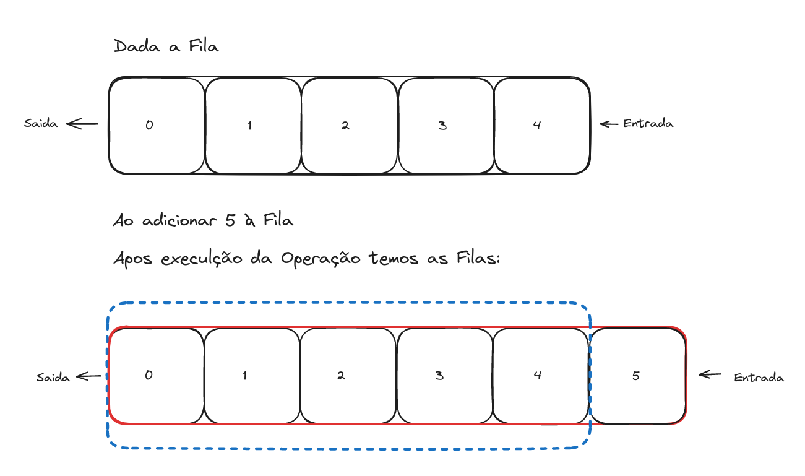

## Tipos de Persistência em Estrutura de Dados

#### Estruturas Parcialmente Persistentes

Estrutura de Dados Parcialmente Persistente ou Implementação Parcialmente Persistente, possuem comportamento semelhante a Estrutura Persistente, quando uma operação que realiza alteração no Estado da Estrutura é realizada o Estado Anterior a operação segue acessível, porém neste caso apenas para consultas, pois somente a versão mais atualizada da Estrutura segue sendo modificável.



No inicio temos a **Fila \[0, 1, 2, 3, 4\]**, ao completar a operação de inserção temos a **Fila \[0, 1, 2, 3, 4\] (fila em azul pontilhado)** e como resultado da operação temos a nova estrutura **Fila \[0, 1, 2, 3, 4, 5\] (fila em vermelho sólido)**. Perceba que o Estado precedente a operação é preservado para consultas na fila inicial, após a operação somente novo Estado segue totalmente maleável podendo ser consultado e alterado.

Exemplo em código:
```js
let queue1 = new Queue([1,2,3,4]);
console.log(queue1); // [1,2,3,4]
let queue2 = queue1.insert(5);
// ou let queue2 = Queue.insert(queue1, 5)
console.log(queue1); // [1,2,3,4]
console.log(queue2); // [1,2,3,4,5]
queue1.insert(6);
// error -> não é possível inserir em queue1
```

Neste cenário o Estado anterior é preservado através de uma referência que apenas aponta para a lista anterior contida na lista atual.

## ---

